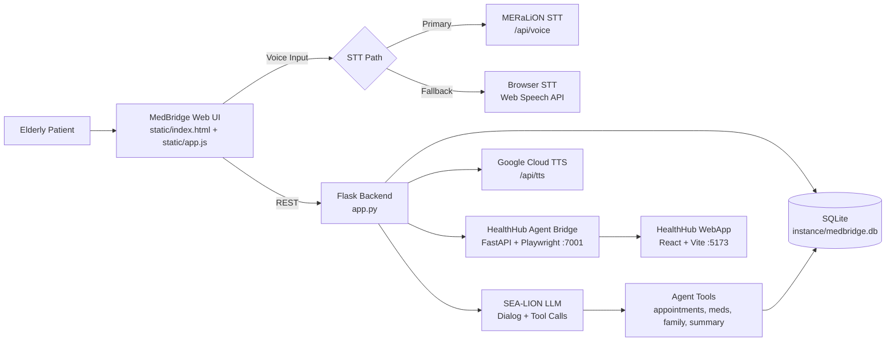

# MedBridge Architecture

This document describes the current MedBridge architecture as implemented in this repository.

## 1) High-Level System

## 2) Main Components

- **Frontend (MedBridge SPA)**: `static/index.html`, `static/app.js`, `static/styles.css`
  - Views: Home, My Health (Agent), Doctor Portal
  - Voice loop: TTS -> STT -> message send
  - Auto language detect option on first utterance
  - HealthHub live preview panel (WebSocket stream from bridge)

- **Backend API (Flask)**: `app.py`
  - Session handling, patient/doctor workflows
  - Language detection endpoint
  - Voice endpoints (STT + TTS)
  - Agent endpoints and tool dispatch

- **Speech-to-Text (Primary)**: MERaLiON via `services/meralion_client.py`
  - Flow: upload-url -> upload audio -> transcribe
  - Health check endpoint: `/api/voice/health`
  - Fallback to browser STT when unavailable

- **Text-to-Speech**: Google Cloud TTS
  - Endpoint: `POST /api/tts`
  - Uses Application Default Credentials (ADC)

- **LLM Layer**: SEA-LION (OpenAI-compatible client)
  - Conversation generation
  - Language classification support
  - Tool-augmented agent behavior

- **Persistence**: SQLite + SQLAlchemy models
  - Patients, sessions/messages, appointments, medications, family members, agent sessions/messages

- **HealthHub Automation Subsystem**
  - `healthhub_agent/` (FastAPI + Playwright)
  - Automates booking and navigation against `HealthHub WebApp/`

## 3) Primary User Flows

### A. My Health (Agentic)
1. User enters name and starts agent session
2. User speaks/types request
3. If auto-detect is enabled, first message is language-classified
4. Backend sends conversation to SEA-LION
5. LLM may call tools (appointments/meds/family/summary or HealthHub automation)
6. Response is returned to UI, optionally spoken via Google TTS
7. If auto mode is on, loop continues (speak->listen)

### B. Doctor Portal
1. Doctor opens session list
2. Backend returns sessions with statuses
3. Doctor opens one session to view:
   - Clinical summary
   - Bilingual transcript (original + translated fields when available)
4. Doctor can mark urgency status

## 4) Key API Surface (Core)

- `POST /api/voice` - MERaLiON transcription
- `GET /api/voice/health` - MERaLiON reachability check
- `POST /api/tts` - Google Cloud TTS synthesis
- `POST /api/language/detect` - language/dialect detection
- `POST /api/agent/start` - create My Health agent session
- `POST /api/agent/sessions/<id>/message` - agent conversation turn
- `GET /api/health-summary` - dashboard aggregate
- `GET/POST /api/appointments`, `GET /api/medications`, `GET/POST /api/family`

## 5) Reliability Notes

- MERaLiON network/DNS failures are expected to trigger fallback behavior.
- Browser STT fallback preserves usability but may reduce multilingual accuracy.
- Google TTS failures fall back to browser speech synthesis in frontend logic.

